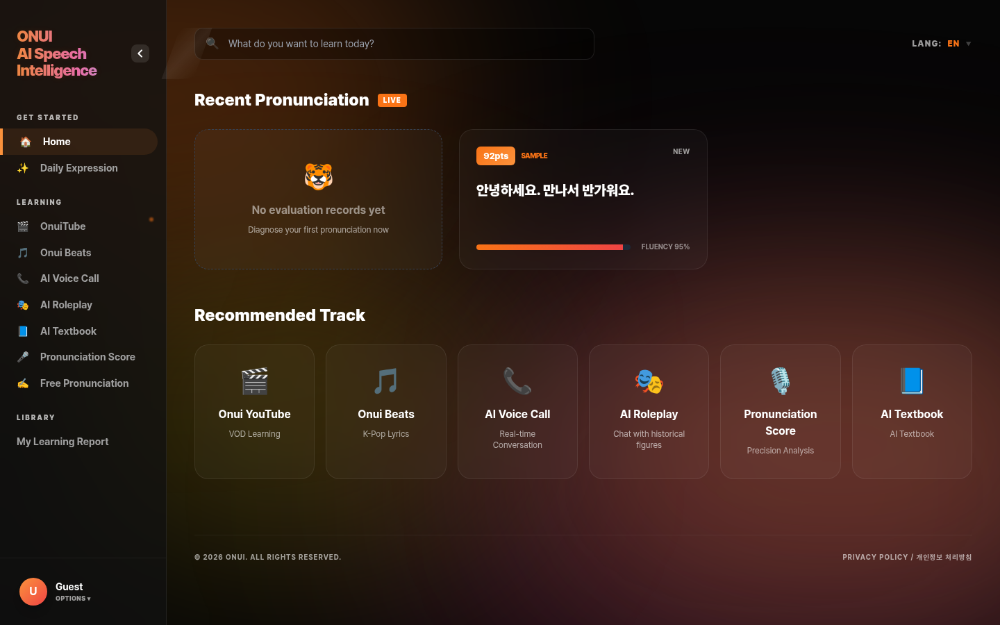
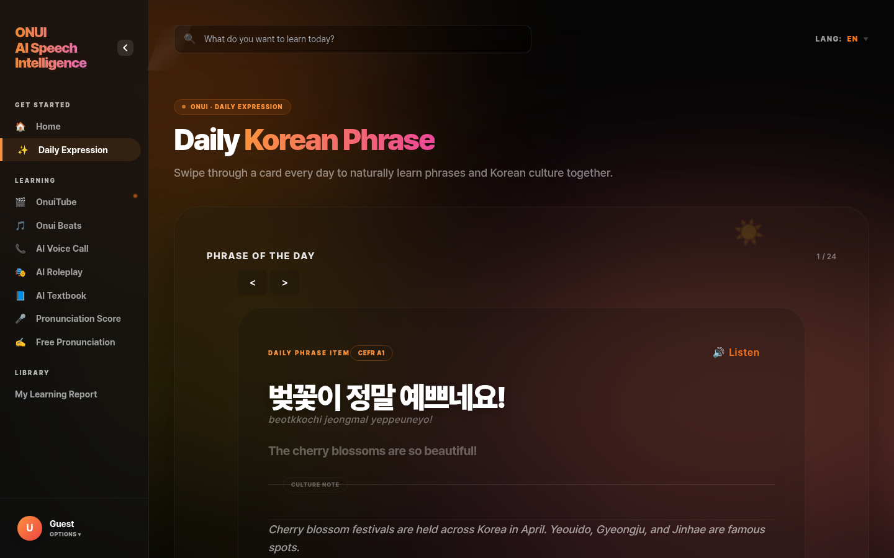
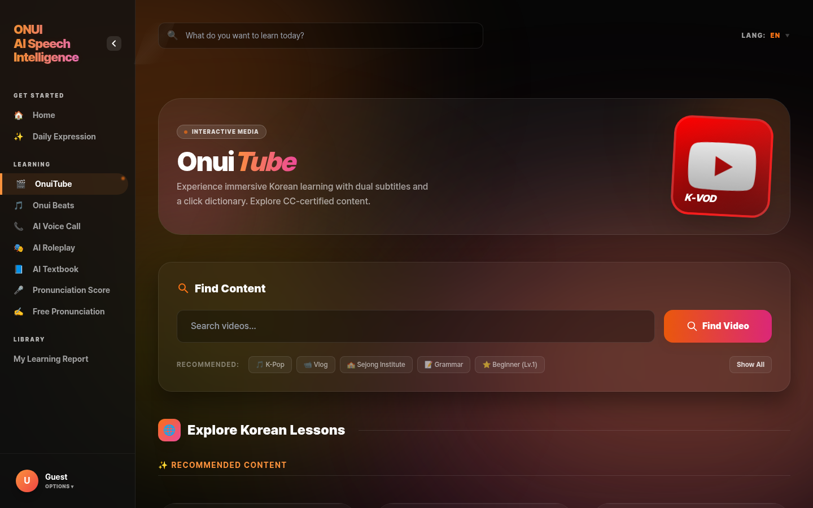
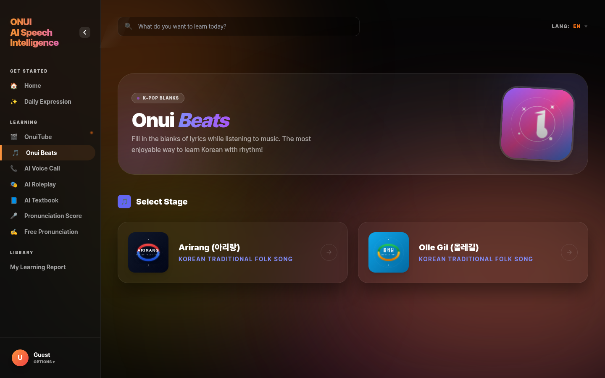
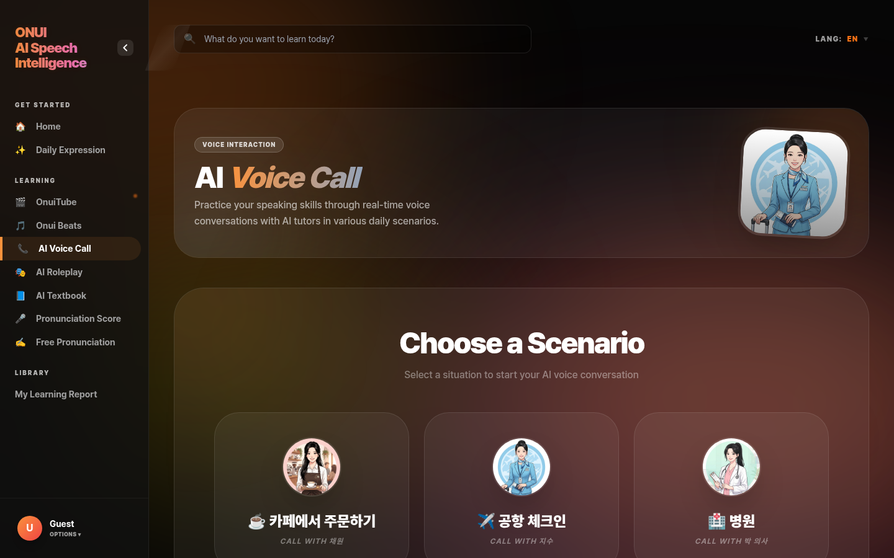
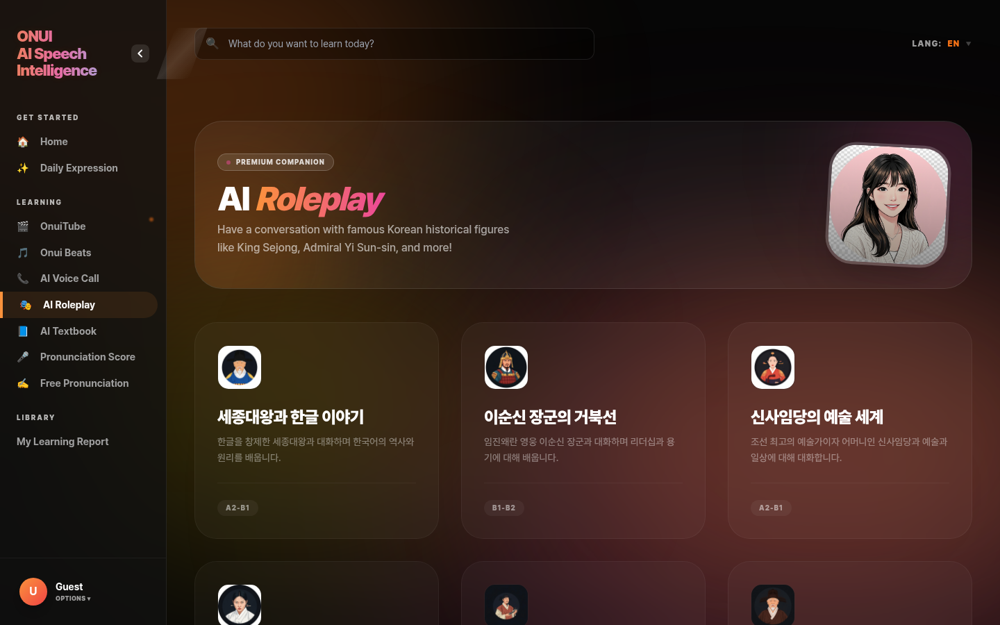
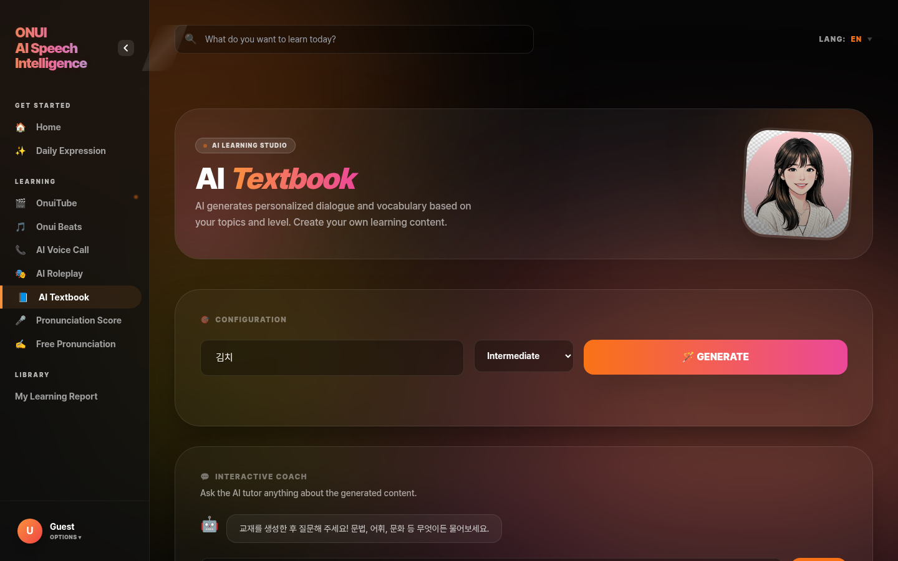
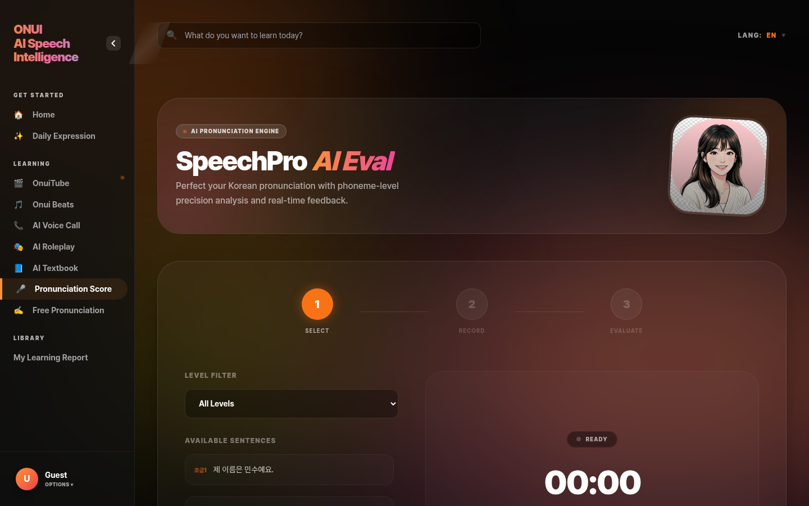
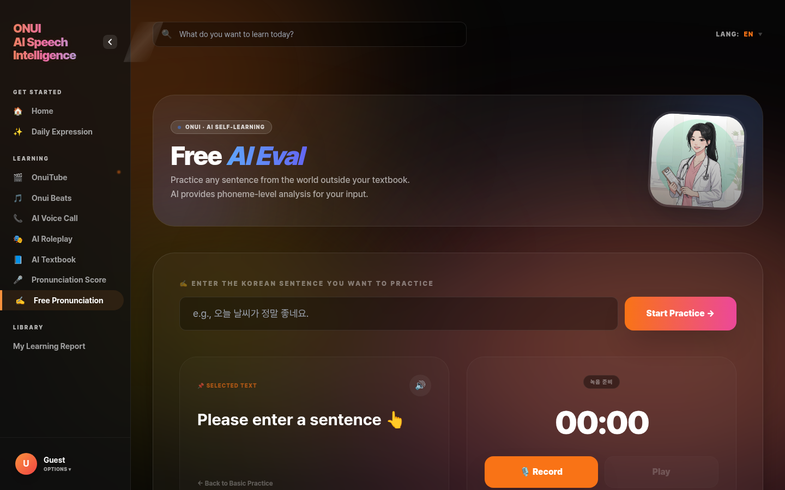
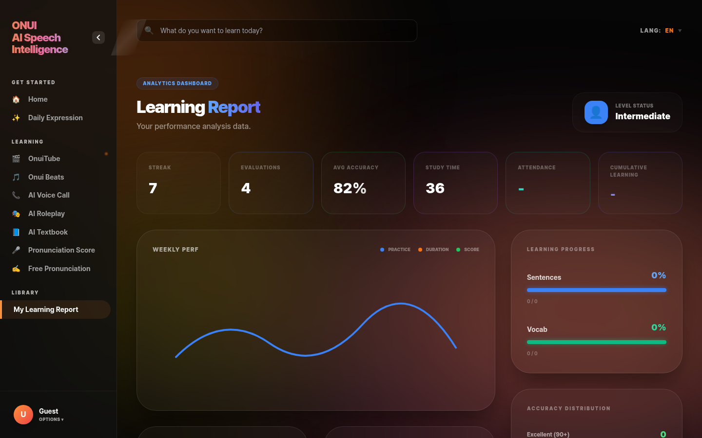

# 오누이 한국어 (ONUI AI Speech Intelligence)
### AI 기반 한국어 학습 플랫폼 소개

> **"Learn Korean Like Me"** — 발음 AI부터 역할극, K-Pop까지. 한 곳에서 완성하는 한국어 학습.

---

## 목차

1. [랜딩 홈](#1-랜딩-홈)
2. [학습 대시보드](#2-학습-대시보드)
3. [오늘의 표현](#3-오늘의-표현--daily-korean-phrase)
4. [OnuiTube](#4-onuitube)
5. [오누이 비츠](#5-오누이-비츠--onui-beats)
6. [AI 음성 통화](#6-ai-음성-통화--ai-voice-call)
7. [AI 역할극](#7-ai-역할극--ai-roleplay)
8. [AI 교재](#8-ai-교재--ai-textbook)
9. [발음 점수 측정](#9-발음-점수-측정--speechpro-ai-eval)
10. [자유 발음 분석](#10-자유-발음-분석--free-ai-eval)
11. [내 학습 보고서](#11-내-학습-보고서--learning-report)
12. [기술 스택](#기술-스택)

---

## 1. 랜딩 홈

**URL:** `/`

ONUI의 핵심 기능인 **SpeechPro 발음 평가**를 메인 화면에서 즉시 체험할 수 있습니다. 별도 회원가입 없이 예문을 녹음하면 AI가 발음을 분석합니다.

**주요 특징**
- 화면 중앙에 예문 표시 + 로마자 표기
- 원클릭 녹음으로 즉시 발음 평가 시작
- 다크 그라디언트 배경의 모던한 UI

---

## 2. 학습 대시보드

**URL:** `/dashboard`

로그인 후 첫 화면. 학습 현황을 한눈에 파악하고 원하는 기능으로 바로 이동할 수 있습니다.

**주요 특징**
- **Recent Pronunciation**: 가장 최근 발음 평가 결과 즉시 표시
- **Recommended Track**: 6개 핵심 기능(OnuiTube, Onui Beats, AI Voice Call, AI Roleplay, Pronunciation Score, AI Textbook)으로 원클릭 이동
- 좌측 사이드바 네비게이션으로 전체 메뉴 접근

---

## 3. 오늘의 표현 — Daily Korean Phrase

**URL:** `/daily-expression`

매일 새로운 한국어 표현을 카드 형태로 학습합니다. 계절·시사·문화 맥락과 함께 제공되어 단순 암기를 넘어선 자연스러운 습득을 돕습니다.

**주요 특징**
- 카드 슬라이더 (← → 이동, 1/24 표시)
- 한국어 원문 + 로마자 발음 + 영어 번역
- **Listen 버튼**으로 원어민 TTS 발음 즉시 청취
- 문화·상황 설명 함께 제공 (예: 벚꽃 축제 배경 설명)

---

## 4. OnuiTube

**URL:** `/video-learning`

한국어 영상을 한/영 이중 자막으로 시청하며 학습합니다. 모르는 단어를 클릭하면 사전이 바로 팝업됩니다.

**주요 특징**
- 키워드 검색으로 영상 탐색 (K-Pop, Vlog, 세종학당, Grammar, Beginner 등 추천 태그)
- **한/영 이중 자막** + 클릭 사전
- K-VOD 콘텐츠 기반 몰입형 학습

---

## 5. 오누이 비츠 — Onui Beats

**URL:** `/onui-beats`

K-Pop 가사 빈칸 채우기 게임. 음악을 들으며 빈칸의 단어를 맞추는 방식으로 어휘와 청취력을 동시에 향상시킵니다.

**주요 특징**
- 아리랑, 올레길 등 한국 전통/대중 음악 수록
- K-Pop Blanks 게임 형식으로 흥미로운 학습
- 가사 전체 표시 + 빈칸 단어 입력 방식

---

## 6. AI 음성 통화 — AI Voice Call

**URL:** `/voice-call`

AI 튜터와 실시간 음성 대화 연습. 카페 주문, 공항 체크인, 병원 등 실생활 시나리오로 구성되어 실전 회화 능력을 기릅니다.

**주요 특징**
- **시나리오 선택**: 카페에서 주문하기 / 공항 체크인 / 병원 등
- 실시간 STT → AI 응답 → TTS 파이프라인
- 각 시나리오별 전용 AI 캐릭터 아바타

---

## 7. AI 역할극 — AI Roleplay

**URL:** `/roleplay`

한국 역사 인물과 직접 대화합니다. 세종대왕, 이순신 장군, 신사임당 등 실제 역사 인물의 어투와 지식을 학습한 AI와 대화하며 역사와 언어를 동시에 배웁니다.

**주요 특징**
- **세종대왕과 한글 이야기** (A2–B1)
- **이순신 장군의 거북선** (B1–B2)
- **신사임당의 예술 세계** (A2–B1)
- 인물별 캐릭터 아바타와 레벨 표시
- Premium Companion 티어

---

## 8. AI 교재 — AI Textbook

**URL:** `/content-generation`

주제와 레벨을 입력하면 AI가 맞춤형 대화문과 어휘 목록을 자동 생성합니다. 교사나 학습자가 원하는 주제의 교재를 즉석에서 만들 수 있습니다.

**주요 특징**
- **주제 자유 입력** (예: 김치, 여행, 직장 등)
- **레벨 선택**: Beginner / Intermediate / Advanced
- GENERATE 버튼으로 즉시 생성
- **Interactive Coach**: 생성된 교재에 대해 AI에게 추가 질문 가능

---

## 9. 발음 점수 측정 — SpeechPro AI Eval

**URL:** `/speechpro-practice`

예문을 낭독하고 음소(音素) 단위까지 분석하는 정밀 발음 평가. 3단계(선택 → 연습 → 평가) 플로우로 구성됩니다.

**주요 특징**
- **레벨 필터**: All Levels / A1 / A2 / B1 / B2
- 예문 목록에서 선택 후 녹음
- 음소 단위 발음 정확도 점수 + 피드백
- 실시간 타이머 표시

---

## 10. 자유 발음 분석 — Free AI Eval

**URL:** `/sentence-evaluation`

교재의 예문이 아닌, 사용자가 직접 입력한 문장을 발음 평가합니다. 자유롭게 원하는 문장을 연습할 수 있습니다.

**주요 특징**
- 한국어 문장 자유 입력
- **Start Practice** 버튼으로 즉시 시작
- 음소 단위 AI 발음 코칭
- Record / Play 버튼 제공

---

## 11. 내 학습 보고서 — Learning Report

**URL:** `/learning-progress`

학습 활동 전체를 데이터로 시각화한 분석 대시보드.

**주요 특징**
- **핵심 지표**: 스트릭(연속 학습일), 평가 횟수, 평균 정확도, 학습 시간, 출석, 누적 학습량
- **주간 성과 그래프**: Practice / Shadowing / Score 추이
- **학습 진도**: Sentences / Vocab 진행률 바
- **정확도 분포**: Excellent (90+) 등 등급별 분포
- 레벨 상태 표시 (Intermediate 등)

---

## 기술 스택

| 영역 | 기술 |
|---|---|
| **Backend** | FastAPI (Python 3.12), SQLite |
| **Frontend** | Jinja2 Templates, Tailwind CSS |
| **AI (LLM)** | Google Gemini 2.5 Flash (기본) / OpenAI GPT / Ollama EXAONE |
| **TTS** | Gemini TTS / OpenAI TTS / Google Cloud TTS / MzTTS |
| **STT** | Vosk (로컬) / Google Cloud / OpenAI Whisper |
| **발음 평가** | SpeechPro API (음소 단위 분석) |
| **인증** | Cookie 세션 + Google OAuth |
| **다국어** | 한국어 · English · 日本語 · 中文 (4개 언어) |

---

> 스크린샷 캡처: 2026-04-15 | 해상도: 1440×900
