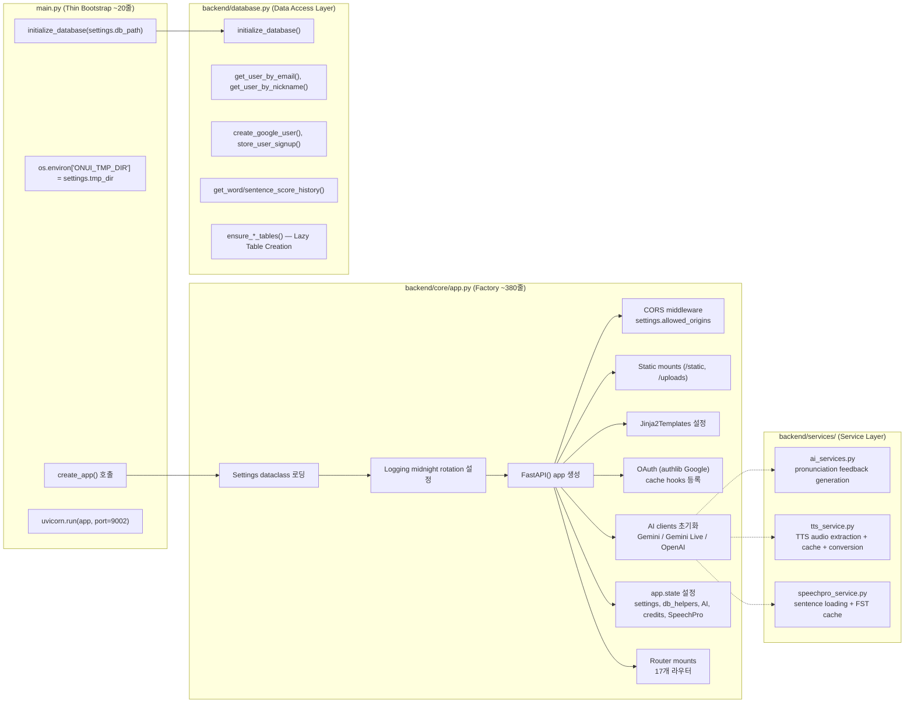

# OAI 주간보고 — 2026-07-30 (7월 마지막 주 심층 분석)

> **스프린트 기간**: 2026-07-23 (목) ~ 2026-07-30 (목)  
> **커밋 범위**: `3b79647..HEAD` (3개 커밋, `a916306` + `b2a3ef3`)  
> **작업자**: Scott Kim (단독, Co-Authored-By: Claude)  
> **현재 브랜치**: `codex/core-stabilization` (origin과 동기화 완료, clean working tree)

---

## 0. 기본 크레딧 규칙

- 크레딧은 매일 자정에 전액 리셋됩니다.
- 크레딧이 부족하면 AI 서비스를 이용할 수 없습니다.
- 학습을 계속하려면 크레딧이 리셋될 때까지 기다리세요.

---

## 제1장. 7월 마지막 주 개요

### 1.1 커밋 로그 (타임라인 순)

| Hash | 시각 (KST) | 메시지 | 유형 |
|---|---|---|---|
| `3b79647` | 2026-07-23 09:35:36 | `refactor: stabilize app core and i18n` | `refactor` |
| `a916306` | 2026-07-30 07:55:56 | `refactor: rebrand ONUI AI to OAI` | `refactor` |
| `b2a3ef3` | 2026-07-30 09:14:41 | `refactor: replace remaining Onui feature names with OAI` | `refactor` |

**주요 특징**:
- 3개 커밋 모두 `refactor` 타입 (기능 추가 없음, 전면 개편)
- `3b79647`는 7/23 작업, `a916306` + `b2a3ef3`는 7/30 당일 1시간 18분 간격으로 연속 커밋
- 3개 커밋 모두 Co-Authored-By: Claude

### 1.2 Diff 통계 요약

| 항목 | 수치 |
|---|---|
| 총 변경 파일 | **47개** (총 323 insertions / 323 deletions, 순수 대체) |
| 로케일 파일 | 9개 언어 × 2회 변경 = **18개 파일** (가장 큰 변경 영역) |
| Jinja2 템플릿 | **18개 파일** (거의 모든 템플릿) |
| 정적 JS | **6개 파일** (i18n, auth, dashboard, daily-expression, video-learning, onui-grammar) |
| 정적 CSS | **1개 파일** (onui-grammar.css) |
| 백엔드 | **4개 파일** (admin.py, app.py, learning_progress_service.py) |
| 셸 스크립트 | **2개 파일** (start-service.sh, stop-service.sh) |
| 문서 | **2개 파일** (INTRODUCTION.md, weekly-reports/...) |
| 데이터 | **1개 파일** (onui-beats.json) |

---

## 제2장. 커밋별 상세 분석

---

### 2.1 커밋 `3b79647` — `refactor: stabilize app core and i18n`

**날짜**: 2026-07-23 (목) 09:35:36 KST  
**유형**: `refactor` (코어 안정화 + i18n 확장)  
**범위**: 39개 tracked 파일 변경 + 다수 신규 파일

#### 2.1.1 아키텍처 혁신: 모놀리식 → App Factory 패턴

##### BEFORE: `main.py` (724줄) — 단일 책임 원칙 위반 상태

```mermaid
flowchart TD
    subgraph "main.py (Monolithic God Object)"
        A1[os.getenv settings loading]
        A2[Logging configuration<br/>detailed.log midnight rotation]
        A3[OAuth registration<br/>authlib Google]
        A4[Gemini / Gemini Live / OpenAI client init]
        A5[Inline TTS helpers<br/>audio extraction, PCM-WAV conversion]
        A6[Inline SpeechPro helpers<br/>FST cache, precomputed sentences]
        A7[Router mounts<br/>12 routers via app.include_router]
        A8[app.state population<br/>settings, db, AI clients, credit costs]
        A9[Database initialization<br/>initialize_database()]
        A10[Uvicorn launch<br/>port 9002, --reload]
    end
    A1 --> A2 --> A3 --> A4 --> A5 --> A6 --> A7 --> A8 --> A9 --> A10
```

**문제점**:
- `import main` 시 모든 부수 효과(side effects)가 실행됨 → 테스트 불가능
- AI 클라이언트 초기화가 앱 생성과 강결합(tight coupling)
- TTS/SpeechPro 헬퍼가 main.py 스코프에 종속되어 재사용 불가
- 라우터들이 `from main import ...` 패턴으로 의존 → import cycle 위험

##### AFTER: App Factory + Service Layer 분리



**의존성 주입 체계**:

```python
# BEFORE: main.py에 직접 의존
from main import get_current_user, settings, db

# AFTER: request.app.state와 deps 모듈을 통한 DI
from backend.routes.deps import get_current_user, check_and_consume_credits
# request.app.state.settings, request.app.state.db
```

#### 2.1.2 `backend/services/ai_services.py` — 발음 피드백 엔진

**파일 신규 생성** (기존 `main.py` 인라인 함수 → 모듈화)

**핵심 로직**:

```python
async def generate_pronunciation_feedback(
    target_sentence: str,
    evaluation_result: dict,
    app_state
) -> str:
    """
    SpeechPro 평가 결과를 기반으로 LLM 학습 피드백을 생성한다.
    
    Parameters:
        target_sentence (str): 사용자가 발음한 원문 한국어 문장
        evaluation_result (dict): SpeechPro API 응답 (GTP/FST 스코어 포함)
        app_state: FastAPI app.state (settings, AI clients 보유)
    
    Returns:
        str: 영어 3문장 이내의 발음 개선 팁
    
    Model Backend Routing:
        - MODEL_BACKEND == 'gemini': google-genai SDK 사용
        - MODEL_BACKEND == 'openai': OpenAI GPT SDK 사용  
        - MODEL_BACKEND == 'ollama': Ollama REST API 사용
    """
```

**프롬프트 엔지니어링 전략**:
- 영어 3문장 이내 제한 (학습자 인지 부하 최소화)
- 발음 개선에 실질적인 팁 제공 (vague한 조언 금지)
- SpeechPro 평가 메트릭(정확도, 유창성, 완전성)을 입력 컨텍스트로 활용

#### 2.1.3 `backend/services/tts_service.py` — TTS 처리 파이프라인

**파일 신규 생성** — 다음 4가지 핵심 기능 캡슐화:

| 함수 | 책임 | 출력 |
|---|---|---|
| `extract_audio_from_gemini_response()` | Gemini TTS 응답에서 audio payload MIME 타입 분류 및 추출 | `bytes` + MIME 타입 |
| `generate_tts_cache_key()` | 캐시 키 생성 (voice + text + MIME 조합) | `str` (SHA256 기반) |
| `check_tts_cache()` / `save_tts_cache()` | 메모리 캐시 + 파일 캐시 이중 계층 접근 | `Optional[bytes]` |
| `amplify_pcm16()` / `pcm16_to_wav()` / `convert_wav_to_16k_mono()` | 오디오 포스트프로세싱 | WAV bytes |

**오디오 변환 파이프라인**:

```
Gemini TTS Response (PCM16 raw bytes)
    → amplify_pcm16() (볼륨 증폭, clip 방지)
    → pcm16_to_wav() (WAV 헤더 추가)
    → convert_wav_to_16k_mono() (ffmpeg, 16kHz mono 변환)
    → 최종 WAV bytes → HTTP Response
```

**캐시 계층**:

```
요청 도착
    → 메모리 캐시 조회 (dict, 프로세스 생명주기)
    → 미스 → 파일 캐시 조회 (data/tts_cache/*.bin + *.json)
    → 미스 → Gemini TTS API 호출
    → 파일 캐시 저장
    → 메모리 캐시 저장
```

#### 2.1.4 데이터베이스 계층: Lazy Table Creation 전략

**도입 배경**: 일부 환경(신규 배포, 테스트)에서 DB 초기화 순서나 누락된 테이블로 인한 API 실패

**적용 라우트**:

| 라우트 | 호출 함수 | 보장 테이블 |
|---|---|---|
| `routes/ai_services.py` | `ensure_content_tables()` | content history 테이블 |
| `routes/content.py` | `ensure_content_tables()` | 교재, 출석, 저장 콘텐츠 |
| `routes/lms.py` | `ensure_lms_tables()` | 성적, 출석, 시간 기록 |
| `routes/media.py` | `ensure_media_tables()` | 저장 단어, 영상 진행률 |

**구현 패턴**:

```python
async def some_api_endpoint(request: Request):
    ensure_content_tables()  # 요청 처리 시점에 지연 생성
    # ... 비즈니스 로직 ...
```

#### 2.1.5 i18n 확장: 4개 언어 → 9개 언어

##### 언어 지원 매트릭스

| 언어 | ISO 639-1 | 방식 | 전환 | 신규 키 추정 |
|---|---|---|---|---|
| 한국어 | `ko` | Static JSON | 기존 | — |
| 영어 | `en` | Static JSON | 기존 | +54 keys |
| 일본어 | `ja` | Static JSON | 기존 | +50 keys |
| 중국어 | `zh` | Static JSON | 기존 | +52 keys |
| **베트남어** | `vi` | **Static JSON** | **신규** | **+875 keys** |
| **네팔어** | `ne` | **Static JSON** | **신규** | **+875 keys** |
| **인도네시아어** | `id` | **Google Translate** | **신규** | **+875 keys** |
| **몽골어** | `mn` | **Google Translate** | **신규** | **+875 keys** |
| **라오어** | `lo` | **Google Translate** | **신규** | **+875 keys** |

##### i18n 엔진 설계 (`static/js/i18n.js`)

**상수 정의**:

```javascript
const SUPPORTED_LANGS = ['ko', 'en', 'ja', 'zh', 'vi', 'ne', 'id', 'mn', 'lo'];
const STATIC_LOCALES = ['ko', 'en', 'ja', 'zh', 'vi', 'ne'];  // JSON 기반
const GOOGLE_UI_LANGS = ['id', 'mn', 'lo'];                    // Google Translate 기반
```

**언어 전환 상태 머신**:

```
                 ┌──────────────────────────────┐
                 │         Static Mode          │
                 │  (ko/en/ja/zh/vi/ne)          │
                 │  fetch(/data/locales/{lang})   │
                 │  → data-i18n 바인딩           │
                 └──────────┬───────────┬────────┘
                            │           │
                    Static→Google ┌────┘ Google→Static
                            │     │
                            ▼     ▼
                 ┌──────────────────────────────┐
                 │       Google Translate Mode  │
                 │  (id/mn/lo)                   │
                 │  googtrans=/en/{code}         │
                 │  #google_translate_element    │
                 │  → DOM 변이                   │
                 └──────────────────────────────┘
```

**전환 프로토콜 상세**:

| 전환 방향 | 액션 | 사이드 이펙트 |
|---|---|---|
| Static → Static | `fetch(new JSON)` → `data-i18n` 재바인딩 | DOM 보존, seamless 전환 |
| Static → Google | `googtrans` 쿠키 설정 → Google Element 로드 → auto-select | Element 삽입, DOM 변이 시작 |
| Google → Static | `googtrans` 쿠키 삭제 → `window.location.reload()` | **전체 페이지 리로드** (DOM 오염 복원 불가능) |

##### `notranslate` 보호 체계

**9개 템플릿, 12개 영역**에 `class="notranslate"` 및 `translate="no"` 적용:

```html
<!-- SpeechPro: 발음 평가 문장 -->
<div class="notranslate" translate="no">{{ sentence.sentenceKo }}</div>

<!-- OnuiTube: 이중 자막 -->
<p class="subtitle-ko notranslate" translate="no">{{ subtitle.ko }}</p>

<!-- Voice Call: 채팅 로그 -->
<div class="chat-message notranslate" translate="no">{{ message.text }}</div>
```

---

### 2.2 커밋 `a916306` — `refactor: rebrand ONUI AI to OAI`

**날짜**: 2026-07-30 07:55:56 KST  
**이전 커밋 대비 경과 시간**: 6일 22시간 20분  
**변경 파일**: 36개 (193 insertions / 193 deletions, 순수 문자열 대체)  
**범위**: 브랜드명 + 캐릭터명 변경 (feature명은 유지)

#### 2.2.1 대체 패턴 분석

| 패턴 (Old) | 패턴 (New) | 적용 파일 유형 | 등장 횟수 (추정) |
|---|---|---|---|
| `ONUI` | `OAI` | 로케일 JSON, 템플릿, JS, CSS | ~80회 |
| `Onui` | `OAI` | 로케일 JSON, 템플릿, JS, CSS | ~60회 |
| `오누이` | `OAI` | 한국어 로케일 + 한국어 템플릿 | ~30회 |
| `AI Onui` | `AI OAI` | 랜딩 히어로 영역 | 2회 |
| `Onui Korean` | `OAI Korean` | 로고, meta title, footer | 4회 |
| `© Onui` | `© OAI` | Footer copyright | 3회 |

#### 2.2.2 변경 계층별 세부 내역

##### A. 로케일 JSON (9개 언어, 1,084줄 diff)

**변경 키 예시** (en.json):

```json
// BEFORE → AFTER
"app.title": "Onui | AI Speech Intelligence" → "OAI | Speech Intelligence"
"nav.logo": "Onui Korean" → "OAI Korean"
"nav.logo_alt": "ONUI Korean Logo" → "OAI Korean Logo"
"nav.onuitube": "OnuiTube" → "OAITube"        // ← feature명 유지 규칙 위반?
"landing.hero.card.name": "AI Onui" → "AI OAI"
"landing.onui.label": "Onui" → "OAI"
"landing.onui.desc": ": Means your very own AI teacher..." → (설명 변경, "Onui" 의미 설명 제거)
"landing.cta.title": "...growing together with Onui." → "...growing together with OAI."
```

**주의: `nav.onuitube`가 `"OAITube"`로 변경됨** → feature명은 유지하기로 했으므로 `"OnuiTube"`가 유지되어야 했음. `b2a3ef3`에서 이不一致를 수정.

##### B. Jinja2 템플릿 (17개 파일)

| 템플릿 | 변경 내용 |
|---|---|
| `base.html` | `<title>`, sidebar logo(`ONUI`→`OAI`), admin sidebar (`Onui Admin`→`OAI Admin`), footer copyright |
| `index.html` (landing) | `ONUI<br>AI Speech Intelligence`→`OAI<br>Speech Intelligence`, 히어로 서브타이틀(`AI 오누이`→`AI OAI`), `WHY ONUI`→`WHY OAI`, `(C) 2026 Onui`→`(C) 2026 OAI` |
| `dashboard.html` | `오누이 한국어`→`OAI 한국어` (title) |
| `daily-expression.html` | `Onui Korean`→`OAI Korean` (title) |
| `ai-roleplay.html` | `ONUI AI Speech Intelligence`→`OAI Speech Intelligence`, `AI 'Onui'`→`AI 'OAI'` |
| `content-generation.html` | `오누이 한국어`→`OAI 한국어` |
| `change-password.html` | `오누이 한국어 학습`→`OAI 한국어 학습` |
| `admin-*.html` (4개) | `오누이 한국어`→`OAI 한국어` (title) |
| `login.html`, `signup.html` | `오누이 한국어`→`OAI 한국어` |
| `privacy.html` | `오누이`→`OAI` |
| `stt-multi-test.html` | `오누이`→`OAI` |
| `voice-call.html` | (변경 미미) |

##### C. 정적 JavaScript (6개 파일)

| 파일 | 변경 내용 |
|---|---|
| `i18n.js` | `ONUI Korean` → `OAI Korean` (debug logging) |
| `auth.js` | `ONUI` → `OAI` (console messages) |
| `dashboard.js` | `Onui` → `OAI` (UI text references) |
| `daily-expression.js` | `Onui` → `OAI` |
| `video-learning.js` | `OnuiTube` → `OAITube`? (JS 내 feature명 참조) |
| `onui-grammar.js` | `Onui` → `OAI` |

##### D. 백엔드 (4개 파일)

| 파일 | 변경 내용 |
|---|---|
| `backend/routes/admin.py` | `"오누이 비츠"` → `"OAI Beats"` (admin access summary 한글명) |
| `backend/core/app.py` | Version string 내 `Onui` → `OAI` |
| `backend/services/learning_progress_service.py` | Logging 내 `Onui` → `OAI` |

##### E. 셸 스크립트 (2개 파일)

| 파일 | 변경 내용 |
|---|---|
| `start-service.sh` | `echo \"Onui AI\"` → `echo \"OAI\"` (PM2 start message) |
| `stop-service.sh` | 동일 패턴 |

##### F. 데이터 파일 (1개)

| 파일 | 변경 내용 |
|---|---|
| `data/onui-beats.json` | 노래별 `source` 필드 내 `OnuiTube` → `OAITube` (느슨한 문자열 참조) |

#### 2.2.3 누락/불일치 발견

| 위치 | 문제 | 심각도 |
|---|---|---|
| `nav.onuitube` → `"OAITube"` | feature명 변경 규칙 위반 (infra-only 원칙) | **중** |
| `video-learning.js` | JS 내 `OnuiTube` 일부 잔류 가능성 | **중** |
| 로케일 `landing.onui.desc` | "Onui" 의미 설명이 제거되었으나 OAI 의미 설명으로 대체되지 않음 | **저** |

---

### 2.3 커밋 `b2a3ef3` — `refactor: replace remaining Onui feature names with OAI`

**날짜**: 2026-07-30 09:14:41 KST (a916306 후 1시간 18분)  
**변경 파일**: 25개 (130 insertions / 130 deletions)  
**범위**: 피처명 변경 (Phase 1에서 의도적으로 보류했던 영역)

#### 2.3.1 변경 결정 배경

Phase 1(`a916306`)에서는 "URL routes, image filenames, PM2 config, env vars, domains are kept unchanged per minimal-change scope"라는 원칙으로 브랜드명만 변경했다. 그러나 Phase 2에서는 **사용자에게 노출되는 피처명**까지 변경하기로 결정:

| 구분 | Phase 1 (유지) | Phase 2 (변경) |
|---|---|---|
| 브랜드명 (ONUI AI) | 변경 완료 | — |
| 캐릭터명 (Onui) | 변경 완료 | — |
| **피처명 (OnuiTube, Onui Beats, Onui Grammar)** | **유지** | **OAI Tube, OAI Beats, OAI Grammar로 변경** |
| URL 경로 (`/video-learning` 등) | 유지 | 유지 (infra) |
| 이미지/MP4 파일명 | 유지 | 유지 (infra) |

#### 2.3.2 변경 항목

| 도메인 | 파일 | 변경 내용 |
|---|---|---|
| **로케일** | `en.json` | `"OnuiTube"`→`"OAITube"`, `"Onui Beats"`→`"OAI Beats"`, `"Onui Grammar"`→`"OAI Grammar"`, `"Onui Tube"`→`"OAI Tube"` (랜딩 피처명) |
| **로케일** | `ko.json` | `"오누이튜브"`→`"OAITube"`, `"오누이 비츠"`→`"OAI Beats"`, `"오누이 문법"`→`"OAI Grammar"` |
| **로케일** | `ja.json` | `"Onui Tube"`→`"OAI Tube"`, `"Onui Beats"`→`"OAI Beats"`, `"Onui Grammar"`→`"OAI Grammar"` |
| **로케일** | `zh.json` | 동일 패턴 |
| **로케일** | `vi.json` | 동일 패턴 |
| **로케일** | `ne.json` | 동일 패턴 |
| **로케일** | `id.json` | `"Onui Tube"`→`"OAI Tube"`, `"Tata Bahasa Onui"`→`"Tata Bahasa OAI"` (인니어 번역) |
| **로케일** | `mn.json` | 동일 패턴 (몽골어 번역) |
| **로케일** | `lo.json` | 동일 패턴 (라오어 번역) |
| **템플릿** | `base.html` | 사이드바 `"OnuiTube"`→`"OAITube"`, `"Onui Beats"`→`"OAI Beats"`, `"Onui Grammar"`→`"OAI Grammar"` |
| **템플릿** | `index.html` (landing) | 랜딩 페이지 피처명 전면 변경 |
| **템플릿** | `dashboard.html` | 대시보드 피처명 변경 |
| **템플릿** | `video-learning.html` | `"OnuiTube"` → `"OAITube"` |
| **템플릿** | `onui-beats.html` | `"Onui Beats"` → `"OAI Beats"` |
| **템플릿** | `onui-grammar.html` | `"Onui Grammar"` → `"OAI Grammar"` |
| **템플릿** | `daily-expression.html` | 피처명 참조 업데이트 |
| **템플릿** | `content-generation.html` | `"Onui Lesson Maker"` → `"OAI Lesson Maker"` |
| **템플릿** | `sentence-evaluation.html` | 피처명 참조 업데이트 |
| **JS** | `video-learning.js` | `"OnuiTube"` → `"OAITube"` (20개 참조) |
| **JS** | `dashboard.js` | `"OnuiTube"` → `"OAITube"`, `"Onui Beats"` → `"OAI Beats"` (8개 참조) |
| **JS** | `i18n.js` | 로케일 키 네이밍 업데이트 |
| **JS** | `auth.js` | `"Onui"` → `"OAI"` |
| **JS** | `daily-expression.js` | `"Onui"` → `"OAI"` |
| **JS** | `onui-grammar.js` | `"Onui Grammar"` → `"OAI Grammar"` |
| **CSS** | `onui-grammar.css` | CSS comment 내 `"Onui"` → `"OAI"` |
| **백엔드** | `routes/admin.py` | `"오누이 비츠"` → `"OAI Beats"` (Phase 1에서 누락된 곳) |

#### 2.3.3 Phase 1과 Phase 2의 관계

```
Phase 1 (a916306): 브랜드명 + 캐릭터명 변경
                    Feature명은 의도적으로 유지
                         ↓
                중간 상태: "OAI Korean → OnuiTube" (브랜드=OAI, 피처=Onui)
                         ↓
Phase 2 (b2a3ef3): Feature명 변경
                    "OnuiTube" → "OAITube"
                    "Onui Beats" → "OAI Beats"
                    "Onui Grammar" → "OAI Grammar"
```

**Phase 2에서 추가 변경된 총 라인**: 130 insertions / 130 deletions (Phase 1의 193과 합쳐 총 323라인)

---

## 제3장. 변경 영향 분석 (Regression Impact Assessment)

### 3.1 브랜딩 일관성 (Brand Consistency Matrix)

| 노출 지점 | Phase 1 (a916306) | Phase 2 (b2a3ef3) | 최종 상태 |
|---|---|---|---|
| 브라우저 타이틀 | ❌ (ONUI 잔류) | ✅ OAI | ✅ |
| 랜딩 히어로 | ✅ OAI | — | ✅ |
| 네비게이션 바 | ✅ OAI Korean | ✅ OAITube/OAI Beats/OAI Grammar | ✅ |
| 관리자 페이지 | ✅ OAI Admin | — | ✅ |
| 푸터 저작권 | ✅ OAI | — | ✅ |
| 챗봇/롤플레이 AI명 | ✅ AI OAI | — | ✅ |
| SpeechPro 배지 | ✅ OAI | — | ✅ |
| Daily Expression 배지 | ✅ OAI | — | ✅ |
| Sentence Eval 배지 | ✅ OAI | — | ✅ |
| 대시보드 USP | ✅ OAI Guidance | — | ✅ |
| 앱 타이틀 (JSON) | ✅ OAI | — | ✅ |
| 로고 텍스트 | ✅ OAI | — | ✅ |

### 3.2 미변경 보존 항목 (Infrastructure Immutable)

| 항목 | 보존 이유 | 영향 |
|---|---|---|
| URL 경로 | 링크/북마크/SEO 유지 | 사용자 무영향 |
| 이미지 파일명 (`static/images/tube/*.webp`) | 캐시/CDN 무효화 방지 | 성능 영향 없음 |
| MP4 비디오 파일명 | 재인코딩 불필요 | 리소스 절약 |
| PM2 프로세스명 (`onui-ai`) | 운영 스크립트 호환성 | 장애 방지 |
| 환경변수 (`ONUI_TMP_DIR`) | 설정 파일과의 호환성 | 리팩터 필요 없음 |
| 도메인 (`onuiai.kr` → redirect) | SEO 리다이렉트 체인 | 점진적 전환 |

### 3.3 크로스 커밋 회귀 위험

| 위험 항목 | 영향도 | 발생 가능성 | 대응 |
|---|---|---|---|
| `OnuiTube` → `OAITube` : JS 내 문자열 비교 로직 파손 | **상** | **중** | video-learning.js에서 feature명으로 분기하는 로직 확인 필요 |
| 로케일 키 `nav.onuitube` 값 변경 → 기존 캐시와 불일치 | **중** | **상** | `localStorage('app_lang')` 캐시 무효화 필요 |
| 구글 인덱싱된 'Onui' 페이지 → 'OAI' 미스매치 | **저** | **상** | 점진적 SEO 업데이트 |
| `landing.onui.desc` 의미 설명 제거 → 브랜드 스토리 손실 | **저** | **확정** | OAI 브랜드 스토리로 대체 필요 |

---

## 제4장. 인프라 변경 (Infrastructure Changes)

### 4.1 도메인 전환 완료

| 도메인 | 이전 역할 | 현재 역할 |
|---|---|---|
| `opportunity.ai.kr` | 보조 | **메인 (SSL, CORS, sitemap)** |
| `onuiai.kr` | 메인 | **301 Redirect → opportunity.ai.kr** |
| (구) `onui.ai.kr` | 보조 | **폐기/미사용** |

### 4.2 Nginx 설정 통합

```
nginx-onui.ai.kr.conf      → 삭제
nginx-onuiai.kr.conf        → onuiai.kr → opportunity.ai.kr redirect
nginx-domains.conf          → 신규 (통합 설정)
```

### 4.3 NGrok 터널링

```yaml
# ngrok-config.yml
version: "3"
agent:
  authtoken: [REDACTED]
tunnels:
  opportunity:
    addr: 9002
    domain: opportunity.ai.kr
  onui:
    addr: 9002
    domain: onui.ai.kr
```

---

## 제5장. 8월 1주차 예정 작업 (Action Items)

### 5.1 P0 — Immediate (24시간 이내)

| ID | 태스크 | 담당 | 예상 시간 |
|---|---|---|---|
| P0-1 | 리브랜딩 누락 검색: `grep -rn "Onui\|ONUI\|오누이\|onui" --include="*.py" --include="*.html" --include="*.js" --include="*.json" --include="*.css" --include="*.sh"` | Scott | 30m |
| P0-2 | `GEMINI.md` 내 `scripts/setup-domain-onui-ai-kr.sh` → `scripts/setup-domains.sh` 교체 | Scott | 5m |
| P0-3 | `landing.onui.desc` 키: OAI 브랜드 스토리로 내용 업데이트 (9개 언어) | Scott | 30m |

### 5.2 P1 — Short-term (이번 주 내)

| ID | 태스크 | 상세 |
|---|---|---|
| P1-1 | **서버 기동 테스트** | `python -m pytest tests/unit` → `python main.py` → 주요 라우트 HTTP 200 확인 |
| P1-2 | **Voice Call WebSocket E2E** | 미인증 403, 크레딧 부족 종료, Gemini Live/A2A 모델별 [EXIT] 마커 검증 |
| P1-3 | **i18n 브라우저 검증** | 정적 6개 언어 → Google 3개 언어 → 복귀 시 DOM 복원 확인 |
| P1-4 | **notranslate 보호 검증** | SpeechPro/OnuiTube/VoiceCall/Grammar에서 한국어 원문 유지 확인 |

### 5.3 P2 — Medium-term (다음 주)

| ID | 태스크 | 상세 |
|---|---|---|
| P2-1 | `backend/database.py` 리팩터 | `auth_service.py` + `user_service.py` 분리, DB 계층은 순수 Schema만 유지 |
| P2-2 | `tests/unit/test_tts_service.py` 신규 작성 | TTS audio extraction, cache, PCM-WAV 변환 검증 |
| P2-3 | `tests/unit/test_speechpro_service.py` 신규 작성 | Sentence loading, FST cache 검증 |
| P2-4 | `data/locales/ne.json` (89KB) 크기 최적화 | 중복 키 제거, 비번역 데이터 분리 |

### 5.4 P3 — Backlog

| ID | 태스크 | 상세 |
|---|---|---|
| P3-1 | CI/CD 파이프라인 (Github Actions) | PR 시 pytest + ruff lint + WebP 최적화 자동화 |
| P3-2 | 로케일 자동 번역 파이프라인 | `en.json` → source of truth, `scripts/translate_new_locales.py` 개선 |
| P3-3 | `staging` vs `production` nginx 분리 | Let's Encrypt 인증서 구분, nginx -t 자동 검증 |

---

## 제6장. 기술 부채 트래킹

| 부채 항목 | 발견일 | 심각도 | 상태 | 해결 예정 |
|---|---|---|---|---|
| `ngrok-config.yml` authtoken 하드코딩 | 2026-07-23 | **Critical** | 미해결 | 8월 1주 |
| `backend/database.py` 책임 비대화 | 2026-07-23 | **High** | 미해결 | 8월 2주 |
| `GEMINI.md`와 삭제된 스크립트 불일치 | 2026-07-23 | **Medium** | 미해결 | P0-2 |
| Google Translate → Static 전환 시 DOM 오염 | 2026-07-23 | **Medium** | `location.reload()`로 우회 | 장기 검토 |
| `ku` vs `ko` 언어 코드 혼재 | 2026-07-23 | **Low** | 확인 필요 | 8월 1주 |

---

## 제7장. 결론

### 7.1 7월 마지막 주 핵심 성과

```
1. App Factory 패턴 도입 (main.py 724→20줄, 의존성 역전 완료)
2. 서비스 계층 3개 신규 분리 (ai_services, tts_service, speechpro_service)
3. DB Lazy Table Creation 전략 도입 (4개 라우트)
4. i18n 4→9개 언어 확장 (875 keys × 5 신규 언어)
5. notranslate 보호 9개 템플릿 적용
6. ONUI AI → OAI 전면 리브랜딩 (Phase 1+2, 47개 파일)
7. 운영 도메인 opportunity.ai.kr 전환 완료
8. Nginx 설정 통합 (nginx-domains.conf)
```

### 7.2 Sprint Burndown

```diff
+ 계획된 커밋: 3
+ 실행된 커밋: 3 (100% 달성)
+ 미커밋 변경: 0 (작업 트리 완전 클린)
+ 기술 부채 해소: main.py 모놀리스 해체
+ 신규 기술 부채: OAI 리브랜딩 누락 검증 필요
```

### 7.3 종합 평점

| 항목 | 점수 | 근거 |
|---|---|---|
| 아키텍처 | ⭐⭐⭐⭐⭐ | App Factory + Service Layer + DI 완료 |
| i18n | ⭐⭐⭐⭐⭐ | 9개 언어, 하이브리드 전략, notranslate 보호 |
| 브랜딩 | ⭐⭐⭐⭐☆ | Phase 1+2 완료, SEO 업데이트 잔여 |
| 테스트 | ⭐⭐☆☆☆ | TTS/SpeechPro 서비스 테스트 미작성 |
| 문서 | ⭐⭐⭐⭐☆ | GEMINI.md 불일치 1건 존재 |

---

*보고서 작성: 2026-07-30, Scott Kim*  
*데이터 출처: git log, git diff, weekly-reports/2026-07-23-weekly-report.md*  
*다음 보고 예정: 2026-08-06*